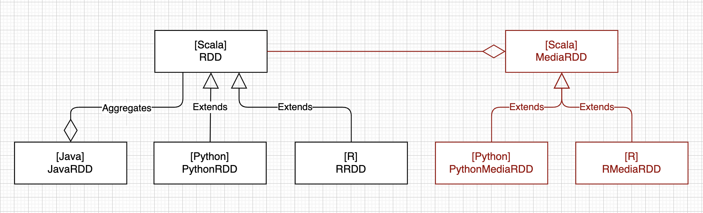

<h1 align="center"> DeepSignal </h1> 
<h3>An Open-Source Framework for Real-Time Multimedia Processing on Apache Spark </h3>
 
 
 
<kbd>
 
</kbd>

# Overview
With the pervasive adoption of cameras and microphones, coupled with the surge in remote communication via video and audio calls, the volume of multimedia data is rapidly expanding. This trend underscores the critical importance of video and audio analysis across diverse sectors, including healthcare, finance, and education. Recognizing this need, the Deep Signal framework emerges as a solution, aiming to provide centralized, real-time analysis of multimedia data. Built on Apache Spark's robust infrastructure, Deep Signal facilitates scalable processing and analysis, ensuring seamless integration across various programming languages and offering developers accessible tools for extracting actionable insights from multimedia sources, ranging from sentiment analysis in customer service calls to content classification in video streams.

 

Media RDD for DeepSignal

## Key Features:

- Real-Time Multimedia Processing: DeepSignal harnesses the power of Apache Spark to provide a real-time processing capabilities for both video and audio streams, ensuring responsiveness at scale.

- Versatility: Tailored for a multitude of applications, DeepSignal excels in various domains such as speech-to-text, text-to-speech, and real-time video call analytics.

- Deep Learning Integration: With advanced deep learning algorithms at its core, DeepSignal empowers developers to achieve state-of-the-art results in multimedia analysis, making it a game-changer for applications that demand intelligent processing.

- Scalability: Built on top of Apache Spark, DeepSignal inherits the robust scalability of the platform, making it ideal for handling large-scale multimedia data processing requirements.

- Open Source: DeepSignal is released as an open-source project, encouraging collaborative development and fostering a vibrant community of contributors. The framework is freely available for developers worldwide.

## Use Cases:
DeepSignal shines in a wide array of applications including:

- Speech to Text: Enable real-time conversion of spoken language into written text with high accuracy.

- Text to Speech: Transform written text into natural-sounding, intelligible speech in real-time.

- Video Call Analytics: Uncover valuable insights from video calls, including sentiment analysis, object recognition, and more.

- Face Recognition: Identify and analyze faces in real-time, facilitating applications such as access control, security monitoring, and personalized user experiences.

- Object Detection: Detect and track objects within video streams, ideal for applications in surveillance, retail analytics, and automated video content analysis.

- Gesture Recognition: Recognize and interpret gestures in live video, enhancing user interaction and engagement in applications like virtual classrooms, gaming, and augmented reality.

## Availability:
DeepSignal is available for immediate use and can be accessed on our [project website/link]. Developers can find comprehensive documentation, tutorials, and an active community support system to facilitate seamless integration into diverse projects.

# How-To
[TBD]()

